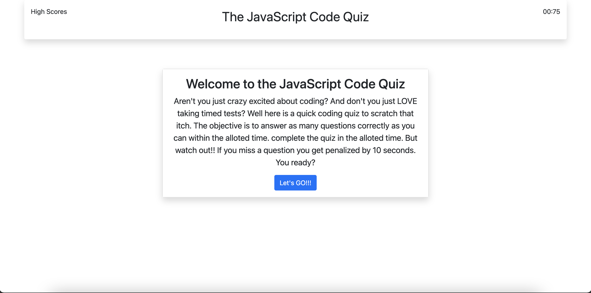
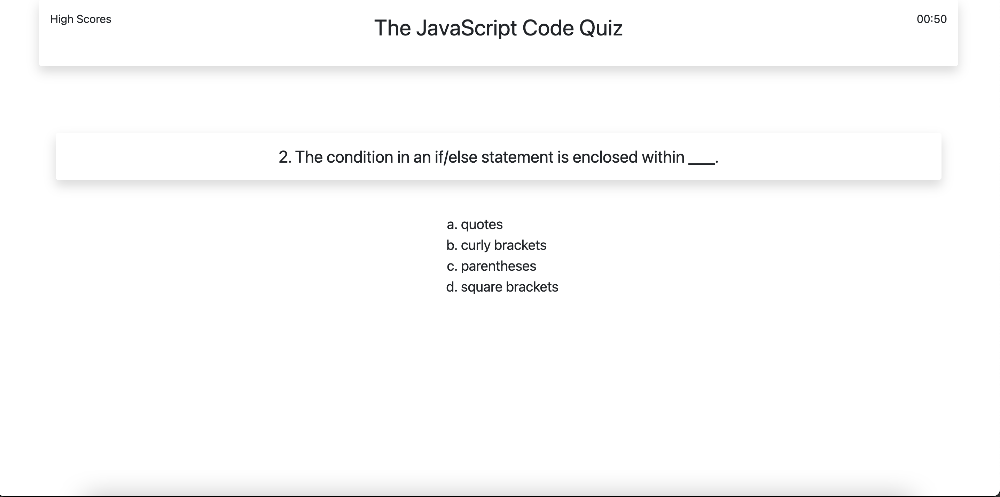
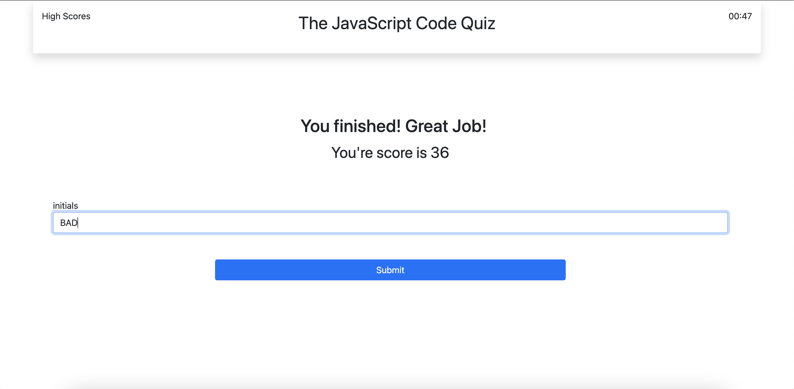

# code-quiz
Coding Quiz challenge

Coding Quiz Challenge
Site - https://roo116.github.io/code-quiz/

## Instructions:

- Click the `Let's Go` button.  
   
   
   
   
   
   
   

- Answer prompts for password length... 
  
   
   
   
   
   
   
   

- enter your initials 
   
   
   
   
   
   
   
   
   
   
   

# Known Issues:

- Code Refactor is required. To meet MVP requirements no code refactor was performed due to time constraints.
- Styling can be improved.
- High Score list is not in order.  Will be corrected in next release.

## MVP Requirements

### User Story
AS A coding boot camp student
I WANT to take a timed quiz on JavaScript fundamentals that stores high scores
SO THAT I can gauge my progress compared to my peers

### Accpetance Criteria
1. WHEN I click the start button THEN a timer starts and I am presented with a question
2. WHEN I answer a question THEN I am presented with another question
3. WHEN I answer a question incorrectly THEN time is subtracted from the clock
4. WHEN all questions are answered or the timer reaches 0 THEN the game is over
5. WHEN the game is over THEN I can save my initials and score

